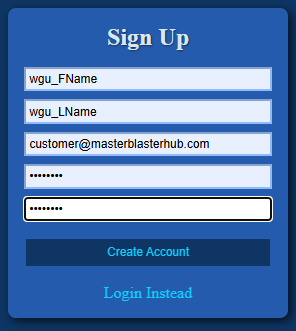
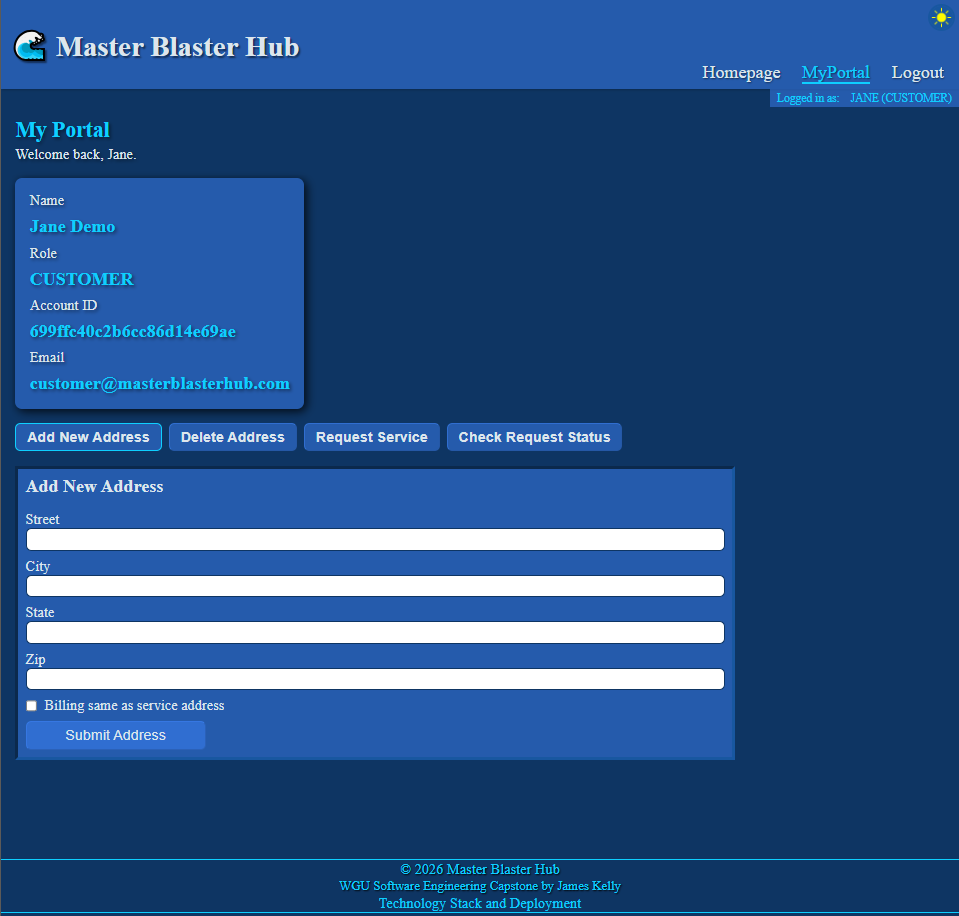
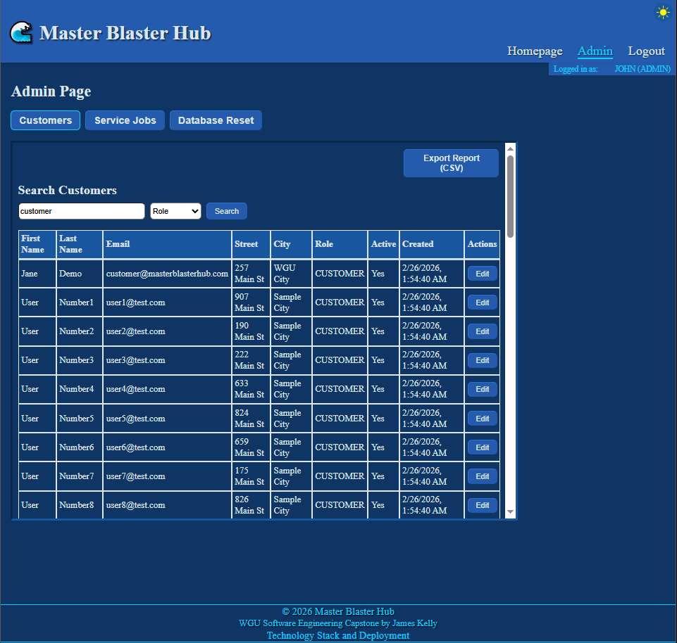
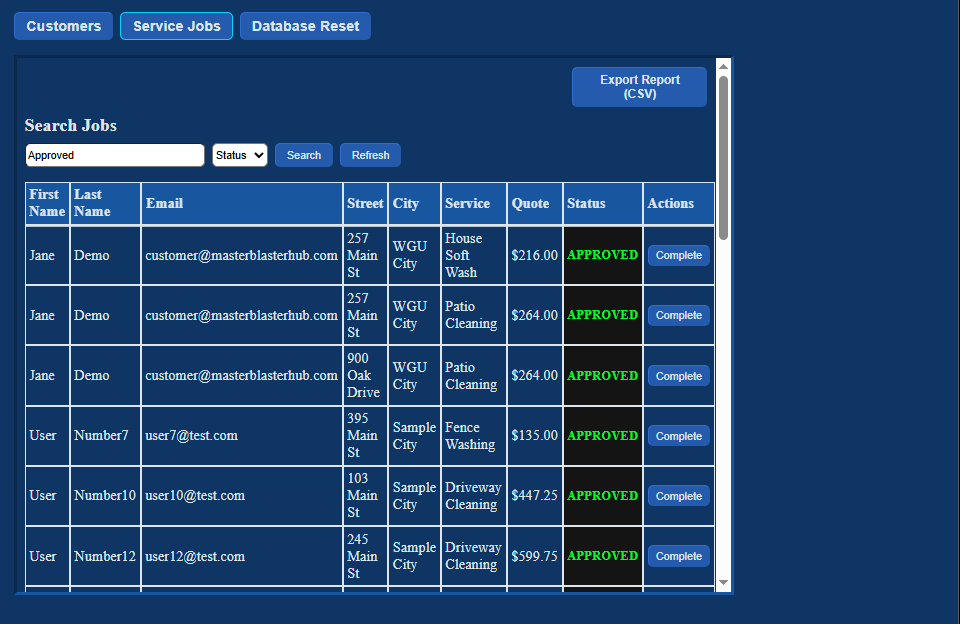
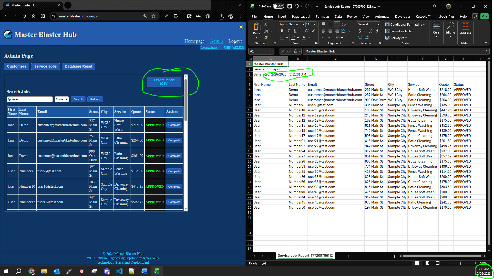

# WGU D424 Software Engineering Capstone
## Master Blaster Hub Web Application

Live URL: https://www.masterblasterhub.com/

**By:** James Kelly  
**Student ID:** 011500695  
**February 25, 2026**

---

## 1. Title and Purpose of the Application

This application, **Master Blaster Hub**, is a full-stack system designed to manage a service-based business from both the customer and administrator perspectives. The platform allows customers to create accounts, manage service locations, and track their job history, while administrators can oversee users, services, and system operations. Built with a React frontend and a Spring Boot backend, the application demonstrates secure authentication, role-based access control, and cloud deployment using modern development practices.

---

## 2. How to Operate the Application

### Customer Guide

#### A. Creating an Account or Logging In

- Navigate to the homepage.
- Select **Sign Up** to create a new account, or **Login** if you already have one.
- Enter your email and password. New users must also provide their first and last name.
- After successful authentication, you will be redirected to your personal portal.

**Easy Access**

Feel free to use the following test credentials for quick access to the customer portal:

Email: customer@masterblasterhub.com  
Password: password  

#### B. Accessing the Customer Portal

Once logged in, customers can access the **My Portal** page.

This is the main dashboard for managing account activity. From this page, users can:

- Add and manage service locations (addresses).
- View current and past job requests.
- Review job details, including status updates and pricing information when available.

#### C. Customer Responsibilities

- Ensure all account information and service addresses are accurate.
- Submit service requests with correct details to avoid delays.
- Monitor job status updates and review pricing when a quote is provided.
- Maintain account security by keeping login credentials private and logging out when finished.

**Customers only have access to their own account information and cannot view or modify other users’ data.**

---

### Admin Guide

#### A. Logging in as an Administrator

- Navigate to the homepage.
- Select **Login** and enter administrator credentials.
- After successful authentication, administrators can access both the customer-facing features and the administrative dashboard.

**Easy Access**

Feel free to use the following test credentials for quick access to the administrator portal:

Email: admin@masterblasterhub.com  
Password: password  

#### B. Accessing the Admin Dashboard

Once logged in, administrators can access the **Admin Dashboard** page.

Administrators have access to protected routes not available to customers. From the Admin Dashboard, administrators can:

- View and manage all registered users.
- Review service requests across the system.
- Update job statuses and generate pricing quotes when required.
- Perform system-level actions, such as database reset (if authorized).
- Export reports for analysis and record-keeping.

#### C. Admin Responsibilities

- Ensure job statuses are updated accurately and in a timely manner.
- Provide correct pricing information when generating quotes.
- Manage user accounts responsibly, including handling access control.
- Perform administrative actions responsibly, especially when executing system-level operations.

**Administrators have elevated permissions and are responsible for maintaining the integrity and reliability of the system.**

---

## 3. Technology Stack & Deployment

Master Blaster Hub is a full-stack web application built with a modern React frontend and a Spring Boot backend. The system is deployed to AWS using a containerized infrastructure.

### Frontend

- React 19
- React Router DOM
- JWT Decode
- Vite (Build Tool)
- CSS Modules
- Responsive Design (Media Queries)
- Fetch API for REST communication

### Backend

- Java 21
- Spring Boot 4.0.2
- Spring Web MVC
- Spring Security
- Spring Data MongoDB
- Spring Validation
- JWT (jjwt 0.11.5)
- MongoDB Atlas
- Maven

### Deployment & Infrastructure

- AWS S3 (Static frontend hosting)
- AWS CloudFront (Content Delivery Network)
- AWS ECS (Elastic Container Service)
- AWS Fargate (Container orchestration)
- AWS ECR (Elastic Container Registry)
- AWS Route 53 (DNS management)
- Docker (Backend containerization)

---

## 6. Git Repository

The source code for this project can be found here:

GitLab Repository:  
https://gitlab.com/wgu-gitlab-environment/student-repos/jkel829/d424-software-engineering-capstone/-/tree/working_branch?ref_type=heads

GitHub Repository:  
https://github.com/jk377y/Master-Blaster-Hub/tree/working_branch