# WGU D424 Software Engineering Capstone
## Master Blaster Hub Web Application

Live URL: https://www.masterblasterhub.com/

**By:** James Kelly  
**Student ID:** 011500695  
**February 25, 2026**

## The source code for this project can be found here:
<a href="https://gitlab.com/wgu-gitlab-environment/student-repos/jkel829/d424-software-engineering-capstone/-/tree/working_branch?ref_type=heads">GitLab Repository</a> 
<a href="https://github.com/jk377y/Master-Blaster-Hub/tree/working_branch">GitHub Repository</a>

---

## 1. Title and Purpose of the Application

This application, **Master Blaster Hub**, is a full-stack system designed to manage a service-based business from both the customer and administrator perspectives. The platform allows customers to create accounts, manage service locations, and track their job history, while administrators can oversee users, services, and system operations. Built with a React frontend and a Spring Boot backend, the application demonstrates secure authentication, role-based access control, and cloud deployment using modern development practices.

---

## 2. How to Operate the Application

### Customer Guide

#### A. Creating an Account or Logging In

- Navigate to the homepage.
- Select **Sign Up** to create a new account, or **Login** if you already have one.
- Enter your email and password. New users must also provide their first and last name.
- After successful authentication, you will be redirected to your personal portal.

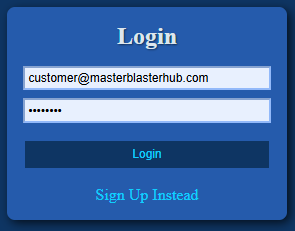

**Easy Access:** Feel free to use the following test credentials for quick access to the customer portal. 
| Credential | Value |
|------------|--------|
| **Email**      | `customer@masterblasterhub.com` |
| **Password**   | `password` | 

#### B. Accessing the Customer Portal

Once logged in, customers can access the **My Portal** page.

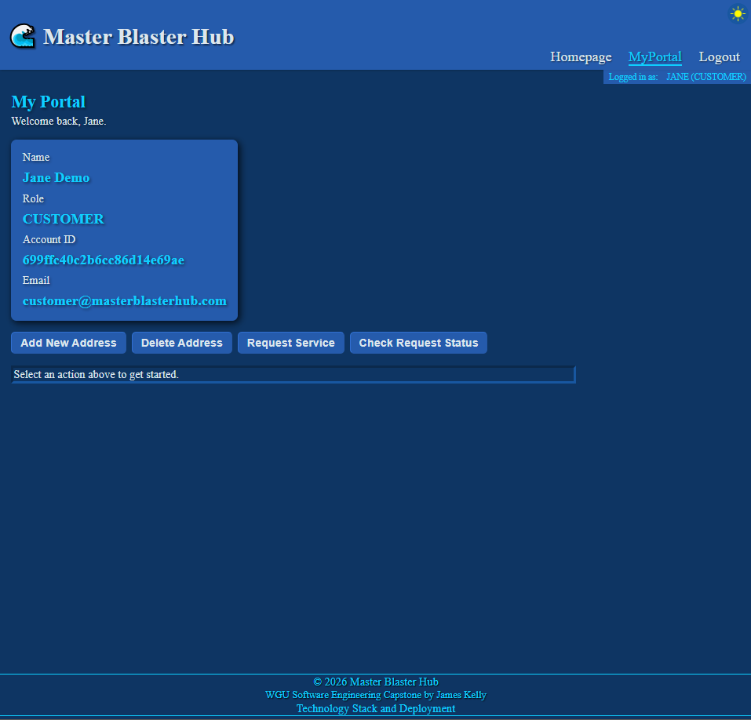

This is the main dashboard for managing account activity. From this page, users can:

- Add and manage service locations (addresses).
- View current and past job requests.
- Review job details, including status updates and pricing information when available.

 
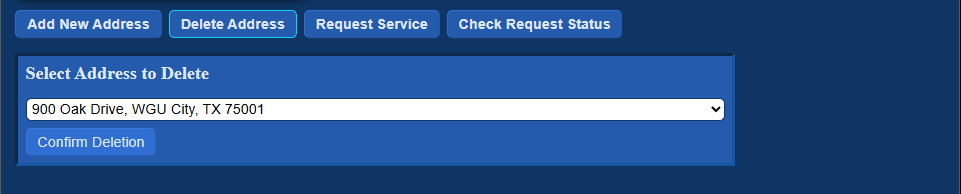 
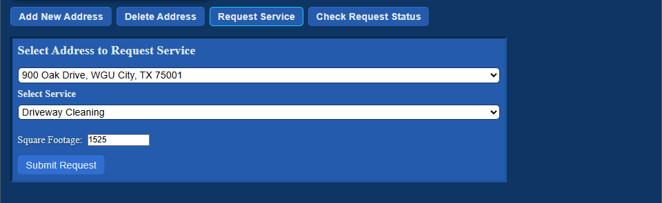 
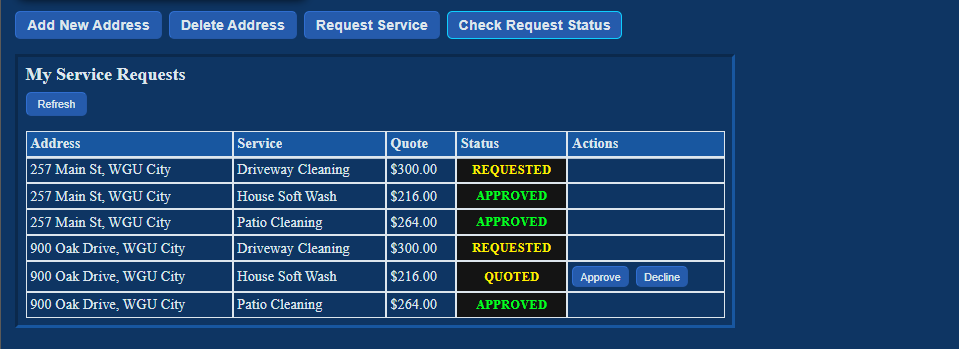 

#### C. Customer Responsibilities

- Ensure all account information and service addresses are accurate.
- Submit service requests with correct details to avoid delays.
- Monitor job status updates and review pricing when a quote is provided.
- Maintain account security by keeping login credentials private and logging out when finished.

**Customers only have access to their own account information and cannot view or modify other users’ data.**

---

### Admin Guide

#### A. Logging in as an Administrator

- Navigate to the homepage.
- Select **Login** and enter administrator credentials.
- After successful authentication, administrators can access both the customer-facing features and the administrative dashboard.

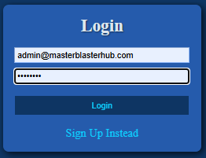

**Easy Access:** Feel free to use the following test credentials for quick access to the administrator portal. 
| Credential | Value |
|------------|--------|
| **Email**      | `admin@masterblasterhub.com` |
| **Password**   | `password` |

#### B. Accessing the Admin Dashboard

Once logged in, administrators can access the **Admin Dashboard** page.

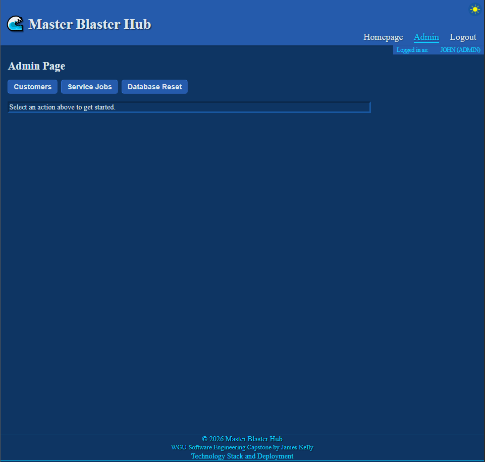

Administrators have access to protected routes not available to customers. From the Admin Dashboard, administrators can:

- View and manage all registered users.
- Review service requests across the system.
- Update job statuses and generate pricing quotes when required.
- Perform system-level actions, such as database reset (if authorized).
- Export reports for analysis and record-keeping.

 
 
 
 

#### C. Admin Responsibilities

- Ensure job statuses are updated accurately and in a timely manner.
- Provide correct pricing information when generating quotes.
- Manage user accounts responsibly, including handling access control.
- Perform administrative actions responsibly, especially when executing system-level operations.

**Administrators have elevated permissions and are responsible for maintaining the integrity and reliability of the system.**

---

## 3. Class Diagram

The following UML diagram represents the core domain model used within the Master Blaster Hub application.

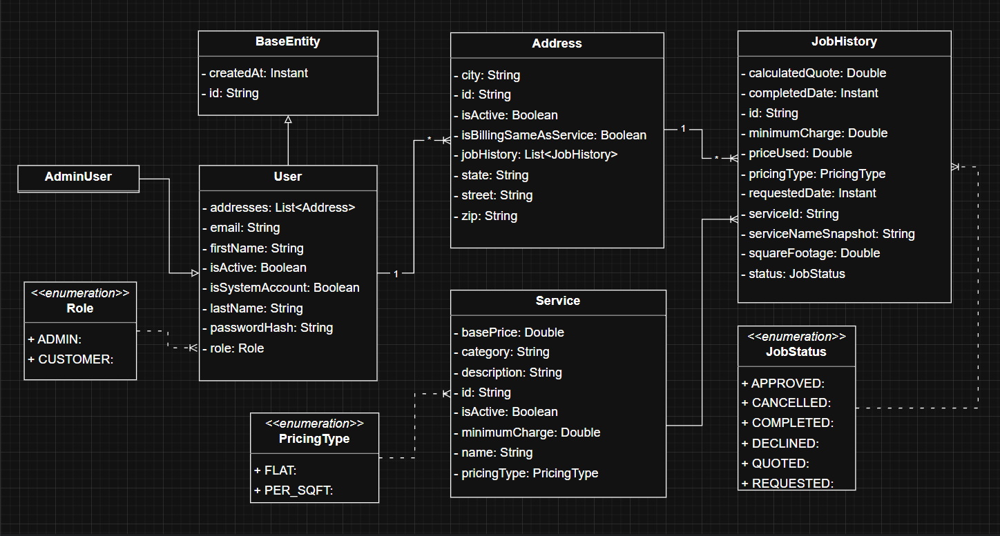 

### Basic Information About the Models

The application is built around several core domain models: `User`, `AdminUser`, `Address`, `JobHistory`, and `Service`. The `User` model stores account information such as name, email, password hash, role, and a list of associated service addresses. Each `Address` represents a service location and contains a collection of `JobHistory` records that track past and current service requests. The `Service` model defines available services, pricing rules, and minimum charges. Enumerations such as `Role`, `PricingType`, and `JobStatus` are used to restrict values and ensure consistency throughout the system.

### How the Models Are Related

The system follows a hierarchical and embedded relationship structure. A single `User` can have multiple `Address` objects, and each `Address` can contain multiple `JobHistory` records. Each `JobHistory` entry references a specific `Service`, capturing pricing details and status at the time of the request. The `Role` enumeration determines whether a user is a customer or administrator, which affects access control and permissions. This structure allows the application to logically group service history under specific service locations while maintaining clear ownership under each user.

### Inheritance, Polymorphism, and Encapsulation

Inheritance is implemented through the `BaseEntity` class, which provides shared fields such as `id` and `createdAt` to other domain models. The `AdminUser` class extends the `User` class, inheriting all standard user properties while representing elevated system privileges. Polymorphism is achieved through role-based behavior, where different user types (customer vs. administrator) are handled through shared interfaces or service logic while maintaining distinct capabilities. Encapsulation is enforced by keeping model fields private and exposing access through getters, setters, and controlled business logic methods. This design protects internal data structures and ensures that changes to an object’s state occur in a controlled and predictable manner.

---

## 4. UI Design

### Login and Signup Screens
The wireframe for the Login and Sign Up screens focuses on simplicity and clarity of user interaction. Each form is centered within a clean container, with clearly labeled input fields and a primary action button placed directly beneath them to guide the user’s attention. The placement of the “Login Instead” and “Sign Up Instead” links reinforces the ability to switch between authentication modes while maintaining a consistent and intuitive design. Overall, the wireframe emphasizes usability, logical flow, and straightforward account access.

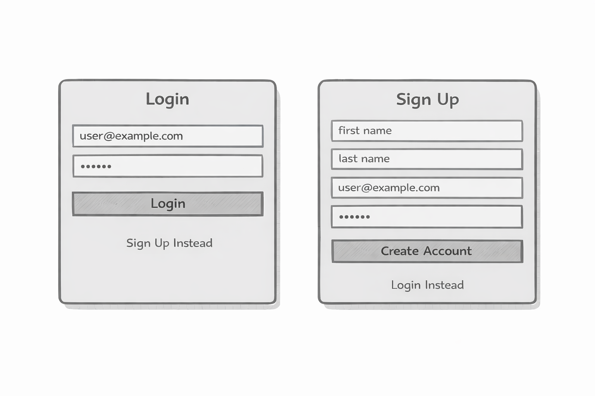 

### Dynamic Header and Navigation
The header wireframe emphasizes role-based navigation and conditional rendering of links. In its default state, the header displays only general navigation options, such as the homepage and authentication controls. Once a user logs in, the header dynamically updates to reveal additional navigation links based on the user’s assigned role. Administrators gain access to the **Admin** link, while customers are granted access to the **My Portal** link. Each role is restricted from viewing the other’s navigation option, reinforcing access control at the user interface level. This design ensures that users only see features relevant to their permissions, creating a cleaner experience while supporting secure, role-controlled navigation.

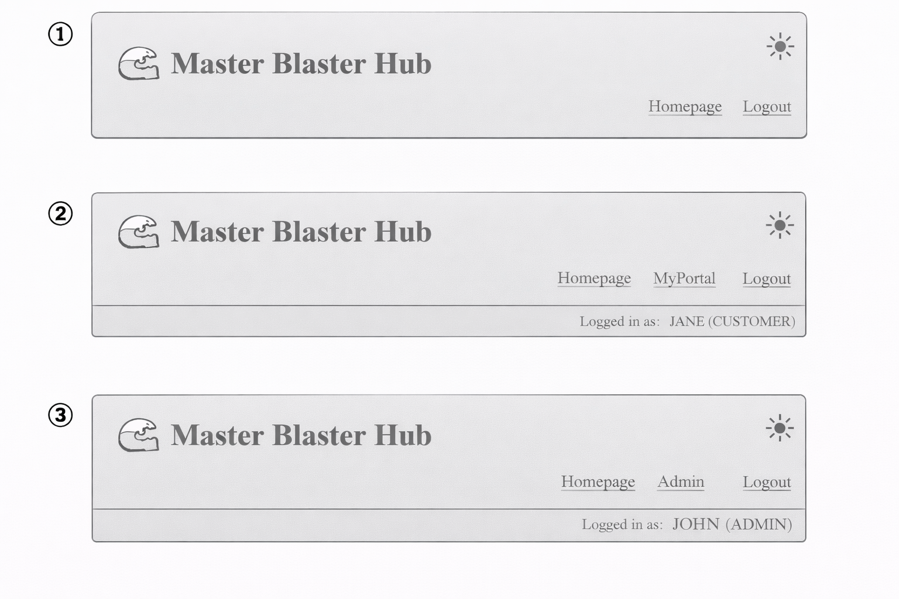 

### My Portal Page (Customer View)
The My Portal wireframe highlights the dynamic panel as the central feature of the page. The layout separates static account information on the left from an interactive content area on the right, emphasizing that the panel updates based on the action selected. The four primary buttons "Add New Address, Delete Address, Request Service, and Check Request Status" control what appears inside this panel without navigating away from the page. Each smaller wireframe example demonstrates how the same panel structure can display different forms or tables while maintaining a consistent layout.

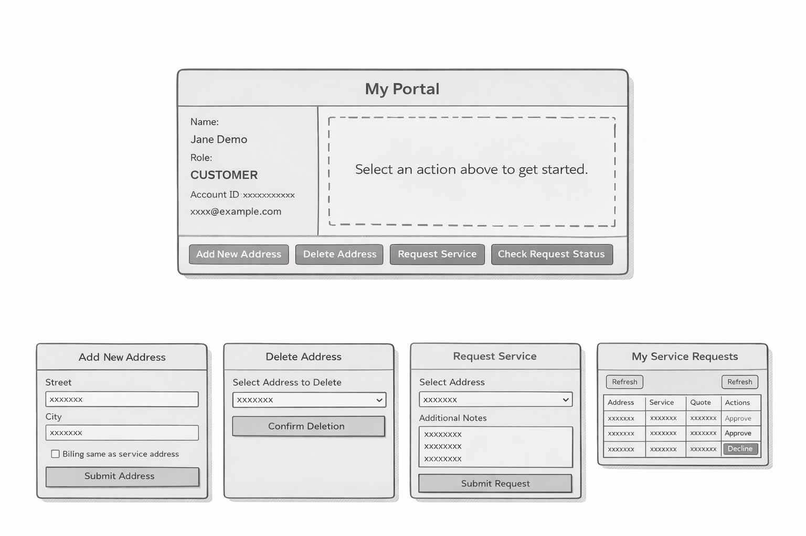 

### Admin Page (Admin View)
The Admin Page wireframe follows the same structural approach as the My Portal design, with a static header and action buttons controlling a dynamic content panel. The three primary controls "Customers, Service Jobs, and Database Reset" determine what information is displayed within the main panel area. When no action is selected, the panel displays a placeholder message prompting the administrator to choose an option. Selecting a button updates the panel to show either a searchable customer table, a searchable job table, or a reset confirmation interface, all within the same consistent layout. The Export Report (CSV) button remains visible within the panel to support data extraction without changing the overall page structure. The data currently displayed in the dynamic panel is what will be exported when the Export Report button is clicked, allowing for flexible reporting based on the administrator’s current view.

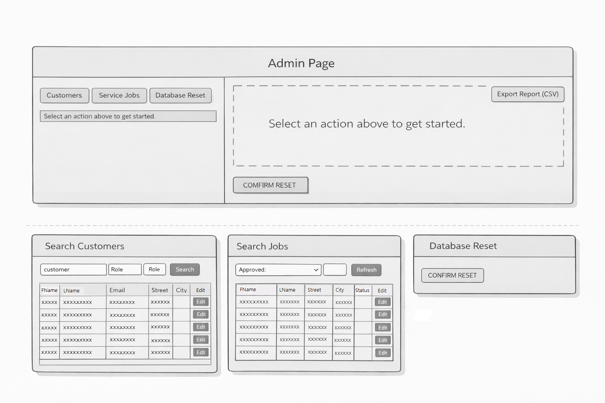 

### Technology Stack & Deployment (Acknowledgement Page)
The Technology Stack & Deployment wireframe presents a structured overview page that acknowledges the major components used to build and deploy the application. The layout features a clear title and brief descriptive text at the top, followed by three evenly spaced content sections representing high-level categories. Each section contains placeholder bullet points, emphasizing organization and readability rather than specific technologies. This design ensures that technical acknowledgments are presented in a clean, professional, and easy-to-scan format.

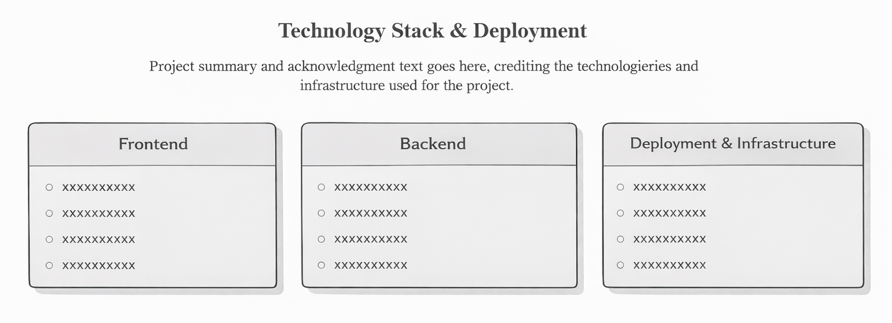 

---

## 5. Unit Testing Overview

Unit testing is the process of verifying that small, individual pieces of code function as expected. Instead of testing the entire application at once, unit tests focus on specific classes or methods in isolation. This helps ensure that business rules are enforced correctly and reduces the risk of introducing errors when changes are made. In this project, unit tests are used to validate role-based permission logic within the service layer.

---

## Individual Unit Test Explanations

### 1. `customerCannotDeleteUser()`
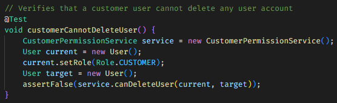 
This test verifies that a customer-level user does not have permission to delete any user account. It creates a customer user and attempts to delete another user, expecting the operation to return `false`. This confirms that deletion privileges are restricted to administrators.

### 2. `adminCanDeleteNonSystemUser()`
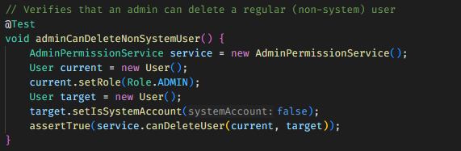 
This test ensures that an administrator can delete a regular, non-system user account. It assigns the current user an admin role and sets the target account as a non-system account. The test expects the permission check to return `true`, confirming that admins have appropriate deletion rights.

### 3. `adminCannotDeleteSystemAccount()`
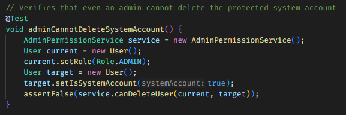 
This test verifies that even an administrator cannot delete a protected system account. The target user is marked as a system account, and the test asserts that deletion returns `false`. This protects critical accounts, such as the master administrative account, from accidental or unauthorized removal.

### 4. `customerCannotViewReports()`
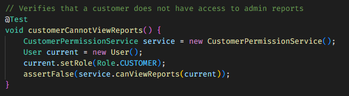 
This test confirms that customer users do not have access to administrative reporting features. A customer role is assigned, and the permission check for viewing reports is expected to return `false`. This ensures that sensitive administrative data remains restricted.

### 5. `adminCanViewReports()`
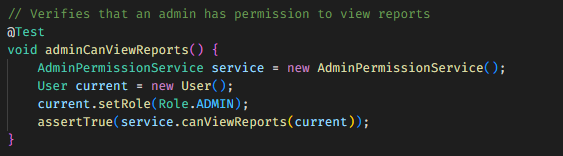 
This test validates that administrators are permitted to access reporting functionality. The current user is assigned an admin role, and the test asserts that the permission check returns `true`. This confirms that reporting capabilities are properly granted to authorized users.

---

## Unit Test Results
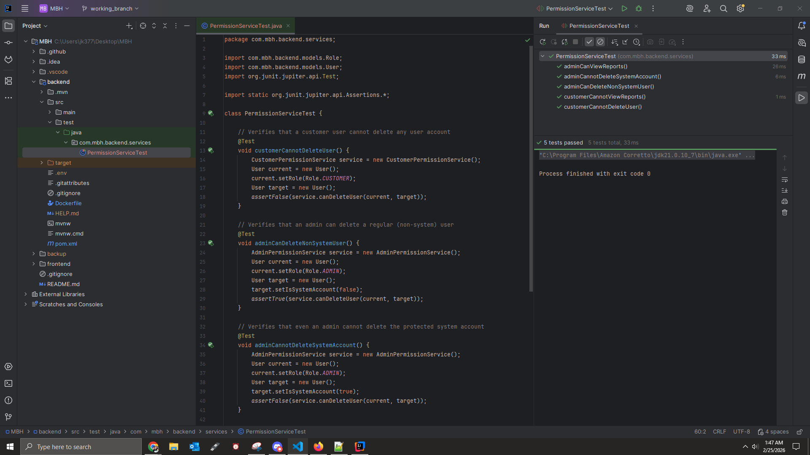 
All five unit tests executed successfully, with each test passing as expected. The results confirm that the permission service correctly enforces role-based access control rules. Customers are restricted from performing administrative actions, administrators have appropriate elevated privileges, and protected system accounts remain safeguarded. These results demonstrate that the core permission logic behaves reliably under the tested scenarios.

---

## 6. Technology Stack & Deployment

Master Blaster Hub is a full-stack web application built with a modern React frontend and a Spring Boot backend. The system is deployed to AWS using a containerized infrastructure.

### Frontend

- React 19
- React Router DOM
- JWT Decode
- Vite (Build Tool)
- CSS Modules
- Responsive Design (Media Queries)
- Fetch API for REST communication

### Backend

- Java 21
- Spring Boot 4.0.2
- Spring Web MVC
- Spring Security
- Spring Data MongoDB
- Spring Validation
- JWT (jjwt 0.11.5)
- MongoDB Atlas
- Maven

### Deployment & Infrastructure

- AWS S3 (Static frontend hosting)
- AWS CloudFront (Content Delivery Network)
- AWS ECS (Elastic Container Service)
- AWS Fargate (Container orchestration)
- AWS ECR (Elastic Container Registry)
- AWS Route 53 (DNS management)
- Docker (Backend containerization)

---

## 7. Git Repositories

The source code for this project can be found here:

GitLab Repository:  
https://gitlab.com/wgu-gitlab-environment/student-repos/jkel829/d424-software-engineering-capstone/-/tree/working_branch?ref_type=heads

GitHub Repository:  
https://github.com/jk377y/Master-Blaster-Hub/tree/working_branch